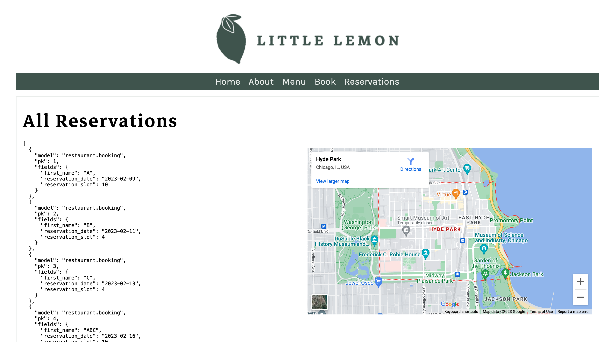
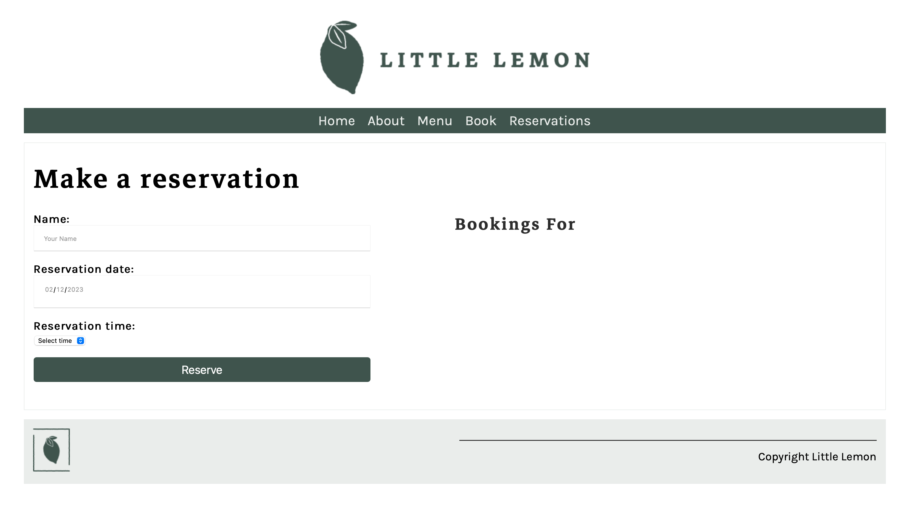

# Little Lemon Booking System
The Little Lemon booking system is a project designed to help users manage and book appointments for their business. This project was created as part of the Meta Backend Developer Certificate program.

# Screenshots
## Screenshot 1: Main Page

Main page of the website.

## Screenshot 2: Booking Page

This is the main booking page where users can view available appointments and make a reservation.

## Screenshot 3: Reservations Page

This is the reservations page where users can view all reservations.

